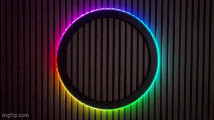

# Equinox

WS2812B LED clock ring with ESP32-S3.


## Hardware

- **Controller**: Waveshare ESP32-S3-Zero (ESP32-S3FH4R2)
- **LED Strip**: WS2812B ring (60 LEDs) on GPIO3
- **Built-in LED**: GPIO21
- **OLED**: SSD1306 128x64 on GPIO2 (SDA) and GPIO1 (SCL)
- **Buttons**: TTP223 touch sensors on GPIO4 (left) and GPIO5 (right)

## Features

- Real-time clock synced via NTP
- Timezone selected via web form (default: +01:00 Paris/Berlin)
- Smooth trailing animations for hour/minute/second hands
- WiFi credential storage in Preferences (persistent across reboots)
- AP fallback mode with web configuration portal
- Rainbow animation in AP mode
- Loading spinner during WiFi connection
- OLED display shows boot count, time, and status
- Left button turns OLED on (10s auto-sleep)
- Right button turns OLED off
- Auto-clear credentials after 5 failed boot attempts
- ArduinoOTA for wireless firmware updates
- Status LED: white/red/green/blue on boot, green (connected)



## Configuration

Edit `include/Equinox.h` to customize:

| Setting | Default | Description |
|---------|---------|-------------|
| `STRIP_PIN` | 3 | GPIO pin for LED strip |
| `STRIP_NUM_PIXELS` | 60 | Number of LEDs on the ring |
| `BUILTIN_LED_PIN` | 21 | GPIO pin for built-in status LED |
| `MCU_POSITION` | "bottom" | LED ring orientation: "top" or "bottom" |
| `CONNECT_TIMEOUT_MS` | 300000 | WiFi connection timeout (5 minutes) |

## Building

```bash
# Build for ESP32-S3
/Users/m600/.platformio/penv/bin/platformio run -e waveshare_esp32_s3_zero

# Upload via USB (hold BOOT button while connecting USB)
/Users/m600/.platformio/penv/bin/platformio run --target upload

# Open serial monitor (921600 baud)
/Users/m600/.platformio/penv/bin/platformio device monitor
```

## OTA Updates

Add to `platformio.ini` for wireless updates:

```ini
[env:waveshare_esp32_s3_zero]
upload_protocol = espota
upload_port = 192.168.x.x  ; device IP address
```

Then upload wirelessly:

```bash
/Users/m600/.platformio/penv/bin/platformio run -e waveshare_esp32_s3_zero --target upload
```

## Usage

### First Boot / No Credentials
1. Device starts in AP mode
2. Connect to "Equinox" network (no password)
3. Open http://10.0.0.1
4. Enter WiFi credentials, select timezone, and save
5. Device restarts and connects

### OLED Controls
- **Left button**: Turn OLED on (auto-sleeps after 10 seconds)
- **Right button**: Turn OLED off

### Timezone
- Selected via dropdown on web form (default: +01:00 Paris/Berlin)
- Stored in NVS for subsequent boots

### Boot Counter
- Displayed on OLED line 1
- Loading spinner segments increase with boot count
- Credentials cleared after 5 failed boot attempts

### AP Mode
Device enters AP mode when:
- No credentials stored
- WiFi connection fails after timeout

## Pin Reference

| Function | Pin |
|----------|-----|
| LED Strip | 3 |
| Built-in LED | 21 |
| OLED SDA | 2 |
| OLED SCL | 1 |
| Button Left | 4 |
| Button Right | 5 |
| BOOT button | 0 |

## Architecture

```
include/Equinox.h       # Single header with all config and declarations
src/main.cpp           # setup() and loop(), FreeRTOS tasks
src/web.cpp            # Web server and WiFi credential management
src/preferences.cpp    # NVS preferences for credentials and boot count
src/network.cpp       # AP mode and OTA initialization
src/oled.cpp           # OLED display
```
